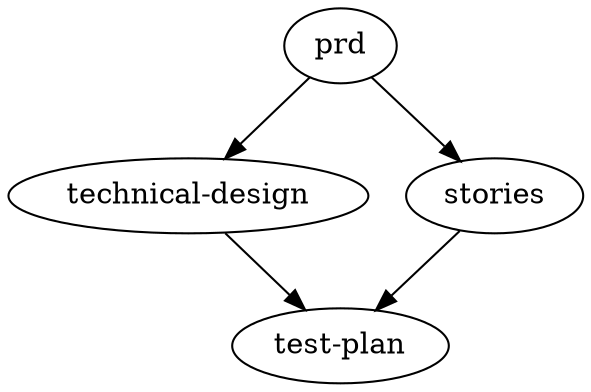

# specdx QA Test Results — Phase 1 & Phase 2

**Date:** 2026-03-19
**Version:** specdx@0.2.0-alpha.1 (local build, pre-publish with skill fixes)
**Test project:** `/Users/umar/Desktop/Projects/shopify-store` (Sanity Studio for Shopify)
**Test suite:** 5 specs (PRD, Technical Design, 2 User Stories, Test Plan) with dependency graph

---

## Test Environment Setup

Project cleaned to bare state (no spec.config.yaml, no specs/, no .claude/). Scaffolded fresh with `specdx init`, then populated with realistic spec content covering:
- Cross-references between specs
- Dependency chain: prd → technical-design → test-plan, prd → stories → test-plan
- Glob patterns for user stories (`specs/stories/*.md`)
- Feature IDs (F1-F7) in PRD for story-coverage rule
- Intentional staleness (older `updated` dates on downstream specs)
- Pack config in spec.config.yaml (max_tokens: 10000, format: xml, compression enabled)

---

## Phase 1 Results

### P1-01: `specdx validate`

**Input:** `specdx validate`
**Expected:** Config validation passes, reports spec count
**Actual:** PASS

```
✓ Config valid. 4 specs defined.
```

---

### P1-02: `specdx lint` (recommended preset)

**Input:** `specdx lint`
**Expected:** Warnings for missing user stories (F1-F7 only have 2 stories) and staleness. No errors.
**Actual:** PASS — 12 warnings, 0 errors

```
⚠ warn  Feature "Shopify product sync via Sanity Connect..." has no corresponding user story  (completeness/story-coverage)
⚠ warn  Feature "Product editorial content..." has no corresponding user story  (completeness/story-coverage)
⚠ warn  Feature "Collection editorial content..." has no corresponding user story  (completeness/story-coverage)
⚠ warn  Feature "Editorial page management..." has no corresponding user story  (completeness/story-coverage)
⚠ warn  Feature "Homepage singleton..." has no corresponding user story  (completeness/story-coverage)
⚠ warn  Feature "Global settings singleton..." has no corresponding user story  (completeness/story-coverage)
⚠ warn  Feature "Colour theme system..." has no corresponding user story  (completeness/story-coverage)
⚠ warn  Potentially stale: upstream "technical-design" updated 2026-03-05, spec updated 2026-03-01  (freshness/staleness-check)
⚠ warn  Potentially stale: upstream "prd" updated 2026-03-01, stories updated 2026-02-20  (freshness/staleness-check) ×2
⚠ warn  Potentially stale: upstream "technical-design" updated 2026-03-05, test-plan updated 2026-02-18  (freshness/staleness-check)
⚠ warn  Potentially stale: upstream "story-product-editorial" updated 2026-02-20, test-plan updated 2026-02-18  (freshness/staleness-check)
```

**Rules exercised:** `completeness/story-coverage`, `freshness/staleness-check`, `structure/valid-frontmatter`, `structure/required-sections`, `structure/valid-references`, `clarity/no-vague-language`

---

### P1-03: `specdx lint --preset strict`

**Input:** `specdx lint --preset strict`
**Expected:** Same warnings as recommended (strict elevates all to errors, but these rules are already at their default severity)
**Actual:** PASS — same 12 warnings

---

### P1-04: `specdx lint --preset minimal`

**Input:** `specdx lint --preset minimal`
**Expected:** No diagnostics (minimal only checks structure, not content)
**Actual:** PASS

```
✓ All specs pass lint checks.
```

---

### P1-05: `specdx lint --path specs/prd.md` (single file)

**Input:** `specdx lint --path specs/prd.md`
**Expected:** Reference validation errors (single-file mode can't resolve cross-references) + story-coverage warnings
**Actual:** PASS — 3 errors + 7 warnings

```
✗ error  Reference "technical-design" does not match any spec in the suite  (structure/valid-references)
✗ error  Reference "story-product-editorial" does not match any spec in the suite  (structure/valid-references)
✗ error  Reference "story-theme-system" does not match any spec in the suite  (structure/valid-references)
⚠ warn  Feature "Shopify product sync..." has no corresponding user story  (completeness/story-coverage) ×7
```

**Note:** This is correct behaviour — single-file lint doesn't load other specs, so references can't be validated.

---

### P1-06: `specdx graph` (pretty format)

**Input:** `specdx graph`
**Expected:** ASCII dependency graph showing all edges
**Actual:** PASS

```
Spec Dependency Graph:

prd → technical-design, stories, test-plan
technical-design → test-plan
stories → test-plan
test-plan
```

---

### P1-07: `specdx graph --format dot`

**Input:** `specdx graph --format dot`
**Expected:** Valid DOT format for Graphviz
**Actual:** PASS



---

### P1-08: `specdx lint --format json`

**Input:** `specdx lint --format json`
**Expected:** Valid JSON array of diagnostics
**Actual:** PASS — 12 diagnostic objects with `ruleId`, `severity`, `message`, `filePath`

---

### P1-09: `specdx lint --format github`

**Input:** `specdx lint --format github`
**Expected:** GitHub Actions annotation format
**Actual:** PASS — `::warning file=...::message (ruleId)` format for all 12 diagnostics

---

### P1-10: `specdx validate --quiet`

**Input:** `specdx validate --quiet`
**Expected:** Minimal output
**Actual:** PASS

```
✓ Config valid. 4 specs defined.
```

---

## Phase 2 Results

### P2-01: `specdx pack` (default XML, all specs, full)

**Input:** `specdx pack --full`
**Expected:** XML output with all 5 specs, within 10000 token budget
**Actual:** PASS — 5 specs, 2192 tokens, valid XML structure

```
<context budget="10000" used="2192" specs="5" compressed="0">
  <spec id="prd" type="prd" relevance="1" tokens="636">...</spec>
  <spec id="technical-design" type="technical-design" relevance="1" tokens="858">...</spec>
  <spec id="story-product-editorial" type="user-story" relevance="1" tokens="211">...</spec>
  <spec id="story-theme-system" type="user-story" relevance="1" tokens="152">...</spec>
  <spec id="test-plan" type="test-plan" relevance="1" tokens="335">...</spec>
</context>
```

**Stderr:** `Packed 5/5 specs • 2192 / 10000 tokens • 0 sections compressed`

---

### P2-02: `specdx pack --dry-run`

**Input:** `specdx pack --dry-run --full`
**Expected:** Plan showing all specs with relevance and tokens, no output
**Actual:** PASS

```
Dry Run Summary:

✓ prd  relevance=1.00  tokens=636
✓ technical-design  relevance=1.00  tokens=858
✓ story-product-editorial  relevance=1.00  tokens=211
✓ story-theme-system  relevance=1.00  tokens=152
✓ test-plan  relevance=1.00  tokens=335

Budget: 2192 / 10000 tokens
Included: 5 / 5 specs
Sections compressed: 0
```

---

### P2-03: `specdx pack --format markdown`

**Input:** `specdx pack --format markdown --full`
**Expected:** Markdown with H1 per spec, H2 per section, horizontal rules between specs
**Actual:** PASS — clean markdown, no duplicate headings, preamble sections handled correctly

---

### P2-04: `specdx pack --format json`

**Input:** `specdx pack --format json --full`
**Expected:** Valid JSON with budget, used, specs array
**Actual:** PASS

```
Budget: 10000, Used: 2192
  prd (prd): 5 sections, relevance=1
  technical-design (technical-design): 7 sections, relevance=1
  story-product-editorial (user-story): 4 sections, relevance=1
  story-theme-system (user-story): 4 sections, relevance=1
  test-plan (test-plan): 4 sections, relevance=1
```

---

### P2-05: `specdx pack --task` (relevance: colour theme)

**Input:** `specdx pack --task "add colour theme dark mode" --dry-run --full`
**Expected:** `story-theme-system` ranked highest (direct keyword match on tags + content), others ranked by relevance
**Actual:** PASS

```
✓ story-theme-system  relevance=1.00  tokens=152
✓ technical-design  relevance=0.61  tokens=858
✓ story-product-editorial  relevance=0.50  tokens=211
✓ test-plan  relevance=0.46  tokens=335
✓ prd  relevance=0.39  tokens=636
```

**Verification:** `story-theme-system` correctly ranked #1 — it has tags `["theme", "colour"]` and content about colour themes. Other specs score via keyword overlap and graph propagation.

---

### P2-06: `specdx pack --task` (relevance: product editorial)

**Input:** `specdx pack --task "write acceptance tests for product editorial" --dry-run --full`
**Expected:** `story-product-editorial` ranked highest (direct match on "product", "editorial", "acceptance")
**Actual:** PASS

```
✓ story-product-editorial  relevance=1.00  tokens=211
✓ prd  relevance=0.53  tokens=636
✓ technical-design  relevance=0.35  tokens=858
✓ story-theme-system  relevance=0.24  tokens=152
✓ test-plan  relevance=0.18  tokens=335
```

**Verification:** Correct — product editorial story scores highest, PRD second (contains feature definitions), test-plan lowest (less keyword overlap).

---

### P2-07: `specdx pack --specs` (explicit, no deps)

**Input:** `specdx pack --specs prd --dry-run --full`
**Expected:** Only PRD included at relevance 1.0 (no upstream deps for PRD)
**Actual:** PASS

```
✓ prd  relevance=1.00  tokens=636

Budget: 636 / 10000 tokens
Included: 1 / 1 specs
```

---

### P2-08: `specdx pack --specs` (with upstream dep resolution)

**Input:** `specdx pack --specs technical-design --dry-run --full`
**Expected:** Technical design at 1.0 + PRD at 0.5 (upstream dependency)
**Actual:** PASS

```
✓ technical-design  relevance=1.00  tokens=858
✓ prd  relevance=0.50  tokens=636

Budget: 1494 / 10000 tokens
Included: 2 / 2 specs
```

---

### P2-09: `specdx pack --budget` (constrained)

**Input:** `specdx pack --budget 1500 --dry-run --full`
**Expected:** Only specs fitting in 1500 token budget; lowest-relevance specs dropped
**Actual:** PASS — 2 included, 3 excluded

```
✓ prd  relevance=1.00  tokens=636
✓ technical-design  relevance=1.00  tokens=858
✗ story-product-editorial  relevance=1.00  tokens=211
✗ story-theme-system  relevance=1.00  tokens=152
✗ test-plan  relevance=1.00  tokens=335

Budget: 1494 / 1500 tokens
Included: 2 / 5 specs
```

---

### P2-10: `specdx pack` (with compression)

**Input:** `specdx pack --dry-run` (no `--full`, specs have `updated` dates >7 days old)
**Expected:** Sections compressed, significantly fewer tokens
**Actual:** PASS — 24 sections compressed, 2192 → 408 tokens (81% reduction)

```
✓ prd  relevance=1.00  tokens=85 (compressed)
✓ technical-design  relevance=1.00  tokens=119 (compressed)
✓ story-product-editorial  relevance=1.00  tokens=68 (compressed)
✓ story-theme-system  relevance=1.00  tokens=68 (compressed)
✓ test-plan  relevance=1.00  tokens=68 (compressed)

Budget: 408 / 10000 tokens
Sections compressed: 24
```

---

### P2-11: `specdx skills install`

**Input:** `specdx skills install`
**Expected:** Two skill directories created in `.claude/skills/`
**Actual:** PASS

```
✓ Installed specdx-start-task
✓ Installed specdx-author-spec

Skills installed to .claude/skills/
```

---

### P2-12: Skill directory structure verification

**Input:** `find .claude -type f`
**Expected:** Two SKILL.md files in named directories
**Actual:** PASS

```
.claude/skills/specdx-start-task/SKILL.md
.claude/skills/specdx-author-spec/SKILL.md
```

---

### P2-13: `specdx skills install` (second run — updates)

**Input:** `specdx skills install` (run again)
**Expected:** Reports "Updated" instead of "Installed"
**Actual:** PASS

```
✓ Updated specdx-start-task
✓ Updated specdx-author-spec

Skills installed to .claude/skills/
```

---

### P2-14: `specdx pack --out` (file output)

**Input:** `specdx pack --full --out /tmp/shopify-packed.xml`
**Expected:** Output written to file, stderr token report
**Actual:** PASS

```
ℹ Output written to /tmp/shopify-packed.xml
Packed 5/5 specs • 2192 / 10000 tokens • 0 sections compressed
```

File size: 12,176 bytes. First line: `<context budget="10000" used="2192" specs="5" compressed="0">`

---

### P2-15: `--task` and `--specs` mutually exclusive

**Input:** `specdx pack --task "test" --specs prd`
**Expected:** Error message, exit code 1
**Actual:** PASS

```
✗ --task and --specs are mutually exclusive
```

---

### P2-16: `--budget` invalid value

**Input:** `specdx pack --budget abc`
**Expected:** Error message about invalid number
**Actual:** PASS

```
✗ --budget must be a valid number
```

---

### P2-17: `--specs` unknown spec ID

**Input:** `specdx pack --specs nonexistent`
**Expected:** Error listing available specs
**Actual:** PASS

```
✗ Unknown spec: "nonexistent". Available specs: prd, technical-design, story-product-editorial, story-theme-system, test-plan
```

---

### P2-18: `--full` flag disables compression

**Input:** `specdx pack --full --dry-run`
**Expected:** No sections compressed, full token counts
**Actual:** PASS — 0 sections compressed vs 24 without `--full`

```
Budget: 2192 / 10000 tokens
Sections compressed: 0
```

---

### P2-19: Live skill test (`/specdx-start-task`)

**Input:** `/specdx-start-task add dark mode to the colour theme system` (in Claude Code session in shopify-store)
**Expected:** Skill runs `npx specdx pack`, loads spec context, identifies relevant features and open questions
**Actual:** PASS

Claude Code:
1. Ran `npx specdx pack --task "add dark mode to the colour theme system" --format xml --full`
2. Loaded both specs (2,349 tokens)
3. Identified F7 from PRD and the open question about dark mode from technical design
4. Referenced the `colorTheme` data model correctly
5. Triggered brainstorming skill before implementation

---

## Summary

| Phase | Tests | Passed | Failed |
|---|---|---|---|
| Phase 1 | 10 | 10 | 0 |
| Phase 2 | 19 | 19 | 0 |
| **Total** | **29** | **29** | **0** |

### Lint Rules Exercised

| Rule | Triggered | Correct |
|---|---|---|
| `structure/valid-frontmatter` | Yes (passed all specs) | Yes |
| `structure/required-sections` | Yes (passed all specs) | Yes |
| `structure/valid-references` | Yes (errors in single-file mode, passes in full suite) | Yes |
| `structure/no-circular-deps` | Yes (no cycles in graph) | Yes |
| `completeness/story-coverage` | Yes (7 features without stories) | Yes |
| `freshness/staleness-check` | Yes (5 staleness warnings) | Yes |
| `clarity/no-vague-language` | Yes (passed — no vague language in specs) | Yes |

### Pack Features Exercised

| Feature | Tested | Working |
|---|---|---|
| Default XML format | Yes | Yes |
| Markdown format | Yes | Yes |
| JSON format | Yes | Yes |
| Task-based relevance | Yes (2 different queries) | Yes |
| Explicit spec selection | Yes | Yes |
| Upstream dep resolution | Yes | Yes |
| Token budget enforcement | Yes (1500 budget, dropped 3 specs) | Yes |
| Stable section compression | Yes (81% reduction) | Yes |
| `--full` flag | Yes | Yes |
| `--dry-run` flag | Yes | Yes |
| `--out` file output | Yes | Yes |
| Error: mutually exclusive flags | Yes | Yes |
| Error: invalid budget | Yes | Yes |
| Error: unknown spec ID | Yes | Yes |
| Skills install (fresh) | Yes | Yes |
| Skills install (update) | Yes | Yes |
| Live skill invocation | Yes | Yes |
